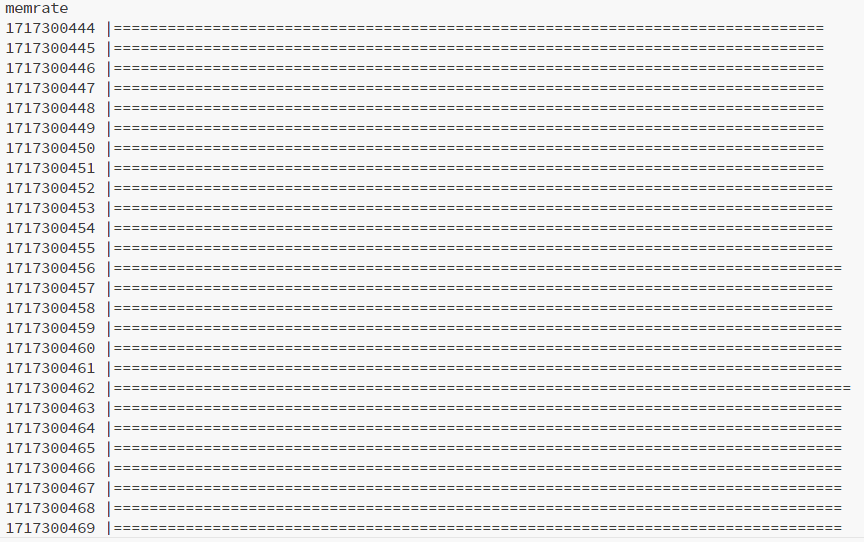

# CLI Tools
Let's build CLI tools!
It's simple tool show chart memory used rate only.
So, the name is memrate.

```stack-lang
(memrate) println (
    now-time round print ( |) print 
    (=) mem-used sys-info mem-size sys-info div 100 mul repeat println
    1 sleep
) true while
```
This tool check memery used rate and show chart once 1 secound.
It's success if the output became like below.

